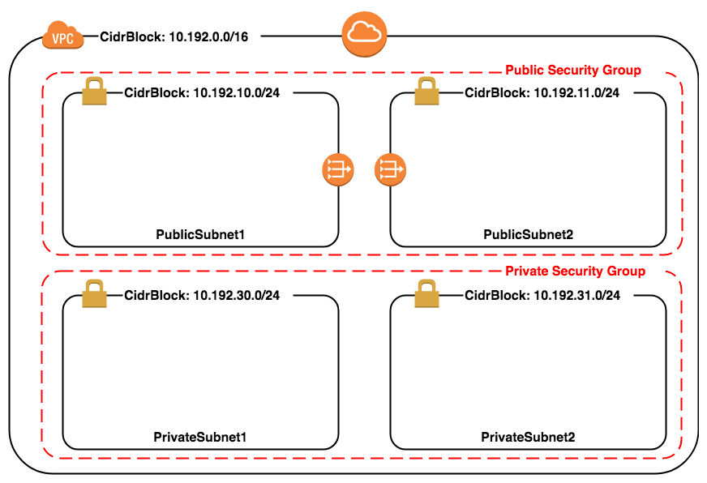
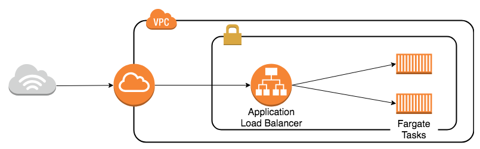
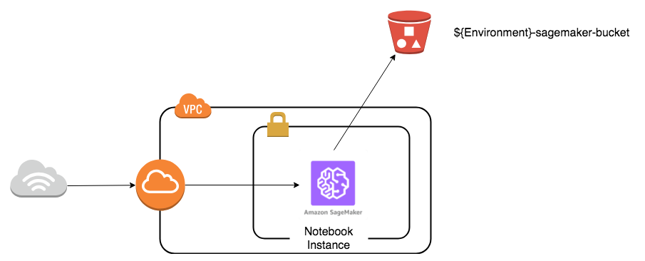

# Networks

Starter kit to build AWS network.



Let's provision the AWS resources from the cloudformation template by executing the following command:

```
$ aws cloudformation deploy --template-file ./networks/template.yaml --stack-name networks-startar-kit --capabilities CAPABILITY_NAMED_IAM
```

With this template, the following resources are constructed.

- VPC
- InternetGateway
- RouteTable
- Nat gateway
- PublicSubnet1
- PublicSubnet2
- PrivateSubnet1
- PrivateSubnet2
- PublicSecurityGroup
- PrivateSecurityGroup


# Fargate web containers

httpd containers on fargate

- Network(VPC~Subnet)
- ApplicationLoadBalancer
- ECSCluster
- ECSService
- ECSTaskDefinition



# SageMaker

- Network(VPC~Subnet)
- NotebookInstance
- S3 Bucket (for train and deploy models)


